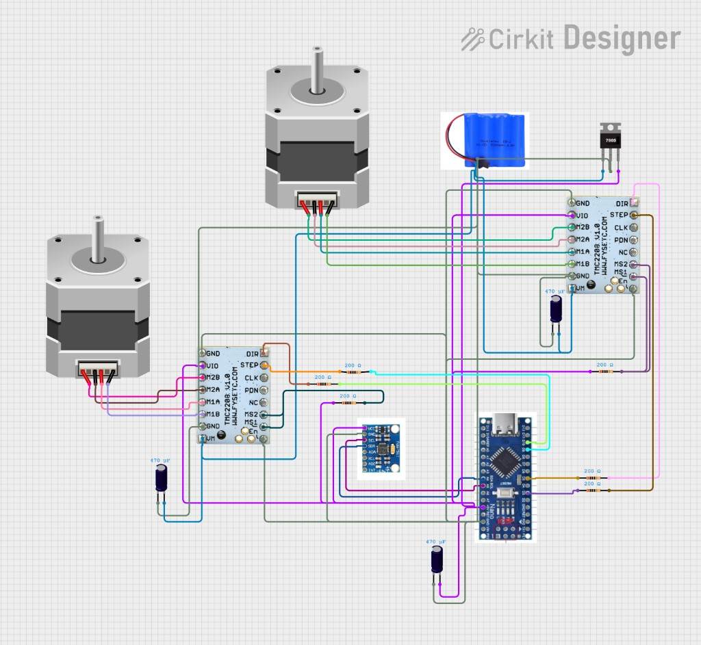

# 🤖 Giro-Robot — двухколёсный балансирующий робот

Подробная инструкция по сборке и настройке двухколёсного гироскопического робота на Arduino Nano с шаговыми двигателями и датчиком MPU-6050.

---

## 📋 Содержание

1. [Как скачать проект](#-как-скачать-проект)
2. [Необходимые компоненты](#-необходимые-компоненты)
3. [Схема подключения](#-схема-подключения)
4. [Блок-схема работы](#-блок-схема-работы)
5. [Структура проекта](#-структура-проекта)
6. [Установка и настройка](#-установка-и-настройка)
7. [Загрузка прошивки](#-загрузка-прошивки)
8. [Калибровка и запуск](#-калибровка-и-запуск)
9. [Устранение неполадок](#-устранение-неполадок)

---

## 📥 Как скачать проект

### Вариант 1: Через Git (рекомендуется)

1. Установите [Git](https://git-scm.com/downloads), если ещё не установлен.
2. Откройте терминал (командную строку) в папке, куда хотите сохранить проект.
3. Выполните команду:

```bash
git clone https://github.com/ВАШ_АККАУНТ/Giro-robot.git
cd Giro-robot
```

> ⚠️ **Важно:** Замените `ВАШ_АККАУНТ` на ваш логин GitHub или скопируйте ссылку клонирования со страницы репозитория (кнопка **Code** → **HTTPS**).

### Вариант 2: Скачать ZIP-архив

1. Откройте страницу репозитория на GitHub.
2. Нажмите зелёную кнопку **Code**.
3. Выберите **Download ZIP**.
4. Распакуйте архив в удобную папку.

---

## 🛠 Необходимые компоненты

| Компонент | Количество | Описание |
|-----------|------------|----------|
| **Arduino Nano** | 1 шт. | Микроконтроллер (мозг робота) |
| **MPU-6050** | 1 шт. | Датчик гироскопа и акселерометра (IMU) |
| **TMC2208** | 2 шт. | Драйверы шаговых двигателей |
| **Шаговые двигатели** | 2 шт. | С 4 проводами (красный, чёрный, зелёный, синий) |
| **Аккумулятор** | 1 шт. | Li-ion 7.4V 2S (или 2×18650) |
| **Стабилизатор 7805** | 1 шт. | Преобразует напряжение в 5V |
| **Конденсаторы 470 мкФ** | 3 шт. | Для стабилизации питания |
| **Резисторы 200 Ом** | 4 шт. | Для сигнальных линий (опционально) |
| **Провода, макетная плата** | — | Для соединений |

---

## 🔌 Схема подключения

Ниже представлена полная электрическая схема подключения всех компонентов. Следуйте ей точно при сборке.



### Таблица подключений

#### Arduino Nano ↔ Драйвер TMC2208 №1 (левый мотор)

| Arduino Nano | TMC2208 №1 | Назначение |
|--------------|------------|------------|
| **D3** | STEP | Импульсы шага |
| **D5** | DIR | Направление вращения |
| **D6** | PDN_UART (TX) | UART для настройки драйвера |
| **D7** | PDN_UART (RX) | UART для настройки драйвера |

#### Arduino Nano ↔ Драйвер TMC2208 №2 (правый мотор)

| Arduino Nano | TMC2208 №2 | Назначение |
|--------------|------------|------------|
| **D9** | STEP | Импульсы шага |
| **D10** | DIR | Направление вращения |
| **D2** | PDN_UART (TX) | UART для настройки драйвера |
| **D4** | PDN_UART (RX) | UART для настройки драйвера |

#### Arduino Nano ↔ MPU-6050 (I2C)

| Arduino Nano | MPU-6050 | Назначение |
|--------------|----------|------------|
| **A4** | SDA | Данные I2C |
| **A5** | SCL | Тактовый сигнал I2C |
| **5V** | VCC | Питание |
| **GND** | GND | Земля |

#### Подключение шаговых двигателей к TMC2208

Каждый двигатель подключается к своему драйверу по контактам **M1A, M1B, M2A, M2B**:

- **Чёрный** → M2B  
- **Красный** → M2A  
- **Зелёный** → M1A  
- **Синий** → M1B  

> 💡 Если мотор крутится в неправильную сторону — поменяйте местами провода одной пары (например, M1A и M1B).

#### Питание

- **Аккумулятор (+)** → Вход 7805, VIO обоих TMC2208 (питание моторов)
- **Аккумулятор (-)** → GND (общая земля)
- **Выход 7805 (5V)** → 5V Arduino, VCC MPU-6050, VIO драйверов (логика)
- **Конденсаторы 470 мкФ** — между VIO и GND у каждого драйвера и у выхода 7805

---

## 📊 Блок-схема работы

Ниже представлена блок-схема, отражающая реальный алгоритм работы Giro-Robot по коду.


### Этап 1: Инициализация (один раз при включении)

1. **Запуск** → инициализация Serial  
2. **Инициализация MPU-6050** → настройка диапазонов гироскопа и акселерометра  
3. **Инициализация TMC2208** → настройка драйверов моторов (ток, микрошаги)  
4. **Калибровка гироскопа** → робот должен быть неподвижен ~5–10 сек  
5. **Сброс PID** → обнуление интегральной и дифференциальной составляющих  

### Этап 2: Основной цикл (~200 Гц, каждые 5 мс)

1. **Чтение MPU-6050** → получение gx, gy, gz (угловая скорость, °/с)  
2. **Коррекция bias** → если робот неподвижен >700 мс, обновляется смещение нуля (анти-дрейф)  
3. **Интегрирование** → угол += скорость × dt → roll, pitch, yaw в градусах  
4. **PID + Feedforward** → error = target_roll − roll → управляющий сигнал u_roll  
5. **Сигнал на шаговики** → преобразование u_roll в скорость моторов  
6. **Баланс** → оба мотора вращаются в противоположных направлениях, робот удерживает вертикаль  

Цикл повторяется каждые 5 мс.

---

## 📁 Структура проекта

```
Giro-robot/
├── code/                    ← Код прошивки
│   └── Giro_robot/          ← Открыть эту папку в Arduino IDE
│       ├── Giro_robot.ino   ← Главный файл
│       ├── shag.h           ← Управление шаговыми двигателями
│       ├── pidbalanse.h     ← PID-регулятор
│       └── balancer.h       ← Логика баланса
├── examples/
│   └── servo_test/         ← Тест моторов без баланса
│       └── servo_test.ino
├── images/                  ← Изображения и схемы
│   ├── circuit_schema.png   ← Схема подключения
│   └── block_diagram.svg    ← Блок-схема работы
├── models/                  ← 3D-модели корпуса
│   └── (.stl, .step и т.д.)
└── README.md
```

### Описание файлов кода

| Файл | Назначение |
|------|------------|
| **Giro_robot.ino** | Основная программа: чтение MPU-6050, калибровка гироскопа, PID-регулятор, управление моторами. Содержит `setup()` и `loop()`. |
| **shag.h** | Модуль управления двумя шаговыми двигателями через TMC2208. Класс `BalanceStepper` — настройка пинов, UART, микрошаги, преобразование выхода PID в скорость моторов. |
| **pidbalanse.h** | Класс `Pid` — PID-регулятор (P, I, D, лимит выхода). Используется для стабилизации угла наклона. |
| **balancer.h** | Класс `BalanceController` — каскадный PID (угол → скорость моторов). Содержит комплементарный фильтр. В текущей версии основной скетч использует только гироскоп. |
| **examples/servo_test/servo_test.ino** | Тестовый скетч для проверки моторов без баланса. Управление: `+` — ускорить, `-` — замедлить (Serial Monitor, 115200 бод). |

### Основные настройки в коде (Giro_robot.ino)

- **OUTPUT_MODE** — режим вывода в Serial (4 = для Serial Plotter)
- **PID_ROLL_KP, PID_ROLL_KI, PID_ROLL_KD** — коэффициенты PID для оси roll
- **MODEL_FF_GAIN** — коэффициент feedforward из физической модели
- **CTRL_X_DEADBAND_DEG** — мёртвая зона по углу (градусы)

---

## ⚙ Установка и настройка

### 1. Установка Arduino IDE

1. Скачайте [Arduino IDE](https://www.arduino.cc/en/software) (рекомендуется 2.x).
2. Установите и запустите.

### 2. Установка библиотек

Откройте **Скетч** → **Подключить библиотеку** → **Управлять библиотеками** и установите:

| Библиотека | Назначение |
|------------|------------|
| **Adafruit MPU6050** | Работа с датчиком MPU-6050 |
| **Adafruit Unified Sensor** | Зависимость для Adafruit MPU6050 |
| **TMC2208Stepper** | Управление драйверами TMC2208 |

### 3. Выбор платы и порта

- **Плата:** Tools → Board → **Arduino Nano**
- **Процессор:** ATmega328P (Old Bootloader) — если Nano старый
- **Порт:** Tools → Port → выберите COM-порт вашей Arduino

---

## 📤 Загрузка прошивки

### Проверка моторов (рекомендуется перед основной сборкой)

1. Откройте `examples/servo_test/servo_test.ino` в Arduino IDE.
2. Загрузите скетч и откройте Serial Monitor (115200 бод).
3. Моторы должны вращаться. Нажимайте `+` и `-` для изменения скорости.
4. Если моторы работают — переходите к основной прошивке.

### Основная прошивка (балансировка)

1. Откройте папку `code/Giro_robot` в Arduino IDE (файл `Giro_robot.ino`).
2. Все необходимые `.h` файлы уже находятся в этой папке.
3. Нажмите **Загрузить** (стрелка вправо) или `Ctrl+U`.
4. Дождитесь сообщения «Загрузка завершена».

> ⚠️ Перед загрузкой **отключите питание моторов** (или только драйверов), чтобы избежать скачков напряжения.

---

## 🎯 Калибровка и запуск

1. **Подключите питание** и поставьте робота вертикально на ровную поверхность.
2. **Не двигайте робота** 5–10 секунд — идёт калибровка гироскопа.
3. Робот должен начать балансировать.
4. Для **перекалибровки** отправьте в Serial Monitor символ `c` или `C`.

### Serial Plotter (отладка)

- Откройте **Инструменты** → **Serial Plotter**.
- Установите скорость **4800** бод.
- Будут отображаться: `roll`, `target_roll`, `u_total`, `pwm`.

---

## ❓ Устранение неполадок

| Проблема | Решение |
|----------|---------|
| Моторы не крутятся | Проверьте питание TMC2208, подключение STEP/DIR, ток (R_SENSE, rms_current в `shag.h`) |
| MPU-6050 не найден | Проверьте SDA→A4, SCL→A5, питание 5V |
| Робот падает в одну сторону | Подстройте PID (Kp, Kd) или проверьте направление моторов |
| Дрожание | Уменьшите Kp или увеличьте мёртвую зону (CTRL_X_DEADBAND_DEG) |
| Долгая калибровка | Держите робота неподвижно, при необходимости отправьте `c` для перекалибровки |

---

## 📄 Лицензия

Проект распространяется свободно. При использовании ссылка на репозиторий приветствуется.

---

**Удачи в сборке Giro-Robot! 🚀**
